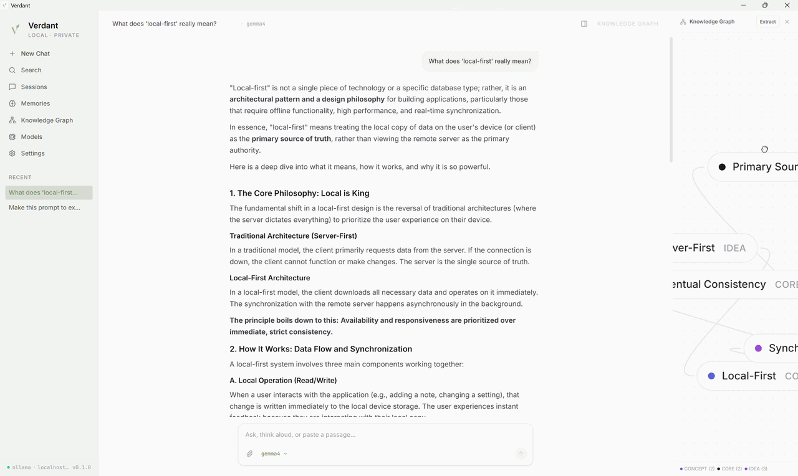

<div align="center">
  
  <h1>Verdant</h1>
  <p><strong>A local-first AI workspace for thinking with local language models</strong></p>

  <p>
    <a href="#key-features">Key Features</a> •
    <a href="#who-its-for">Who It's For</a> •
    <a href="#what-makes-it-different">What Makes It Different</a> •
    <a href="#getting-started">Getting Started</a>
  </p>

  <!-- Replace this comment or the source below with your actual demo GIF later -->
  <div align="center" style="margin: 20px 0;">
    
  </div>
</div>

---

## What is Verdant?

**Verdant** is a premium, privacy-focused desktop application that turns your local LLMs (powered by Ollama and other local providers) into a structured cognitive playground. 

Instead of just discarding your conversations, Verdant acts as an offline thinking partner. It saves your sessions into a local SQLite database, automatically extracts key entities and concepts, synthesizes them into an **interactive Knowledge Graph**, and manages a **persistent Memory Bank** to capture long-term context.

---

## Who It's For

- **Privacy-Conscious Professionals**: Developers, writers, and analysts who handle sensitive data and cannot upload transcripts to external clouds.
- **Researchers & Knowledge Managers**: Users who want to visualize semantic connections, tag sessions, and query relationships between ideas.
- **Local AI Enthusiasts**: Anyone running Ollama, Llama.cpp, or Hugging Face models locally who wants a beautiful, responsive UI that goes far beyond simple web chat wrappers.

---

## What Makes It Different?

Unlike generic chat clients, Verdant is built around **structured memory and visual association**:

* 🌲 **Sage Green Design System**: A premium, minimalist, and responsive user interface custom-tailored with organic green design tokens for maximum visual comfort.
* 🧠 **Autonomous Knowledge Graphs**: As you chat, Verdant parses sessions, detects key concepts, and plots them in an interactive graph page powered by React Flow.
* 💾 **Completely Offline & Self-Contained**: Backed by a secure Rust-based Tauri core and a local SQLite (`verdant.db`) database.
* ⚡ **Ultra-Fast Desktop Integration**: Multi-threaded Rust command handlers manage message retrieval, graph extraction, and system hooks with zero cloud lag.

---

## Key Features

### 💬 Rich Multi-Session Chat
- Supports markdown rendering, syntax-highlighted code blocks, and list formats.
- Inline mathematical LaTeX rendering.
- Quick model selection dropdown displaying currently pulled Ollama models.
- **Keyboard Shortcuts**: Start a new chat instantly with `Cmd + N` / `Ctrl + N` or access search via `Cmd + K` / `Ctrl + K`.

### 🕸️ Interactive Knowledge Graph
- Visualizes connections between subjects discussed in your chat histories.
- Clickable nodes with custom category tags, color mappings, and spatial layouts.
- Live graph extraction panel right inside the chat window.

### 🗃️ Persistent Memory Bank
- Categorizes extracted memories (e.g. system instructions, facts, project scopes).
- Easily update, search, delete, or manually add memories.
- Export your memories, sessions, or graph state to standard Markdown or JSON files.

### ⚙️ Local Provider Management
- Connect to Ollama or custom local server endpoints.
- Auto-detects connected status and active model instances.

---

## Getting Started

### Prerequisites
1. **Node.js** (v18 or higher)
2. **Rust** compiler and Cargo toolchain
3. **Ollama** installed and running on your local machine (`ollama run <model>`)

### Installation & Run

1. **Clone the Repository**
   ```bash
   git clone https://github.com/yourusername/verdant.git
   cd verdant
   ```

2. **Install Dependencies**
   ```bash
   npm install
   ```

3. **Run in Development Mode**
   ```bash
   npm run tauri dev
   ```

4. **Build Production Desktop App**
   ```bash
   npm run tauri build
   ```

---

## Tech Stack

- **Frontend**: React, TypeScript, Tailwind CSS, React Flow, Radix UI, Zustand (State Management)
- **Desktop/Backend**: Tauri v2, Rust (Tokio, Rusqlite, Serde)
- **Database**: SQLite (`verdant.db`)

---

<div align="center">
  <sub>Built with 💚 for local and private AI workspaces.</sub>
</div>
